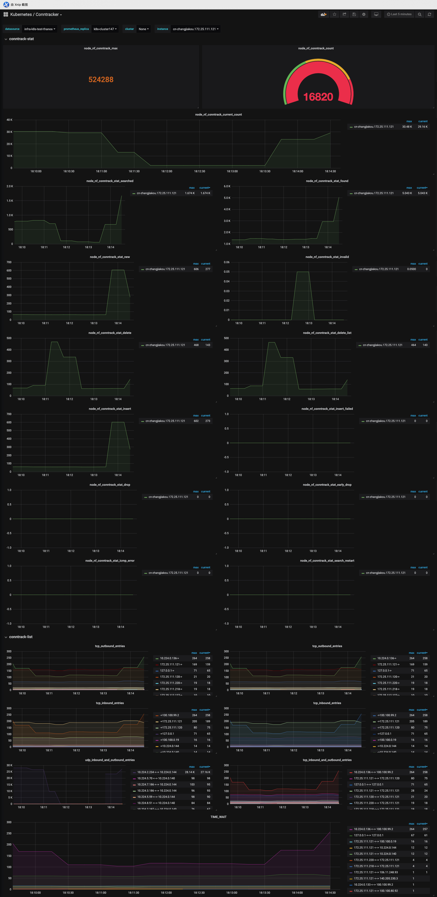

# conntrack-exporter
collect conntrack metrics in kubernetes cluster

## install

```bash
kubectl apply -f https://raw.githubusercontent.com/zjj2wry/conntrack-exporter/master/deploy.yaml
```

## grafana

load kubernetes-conntracker-grafana.json in your grafana


